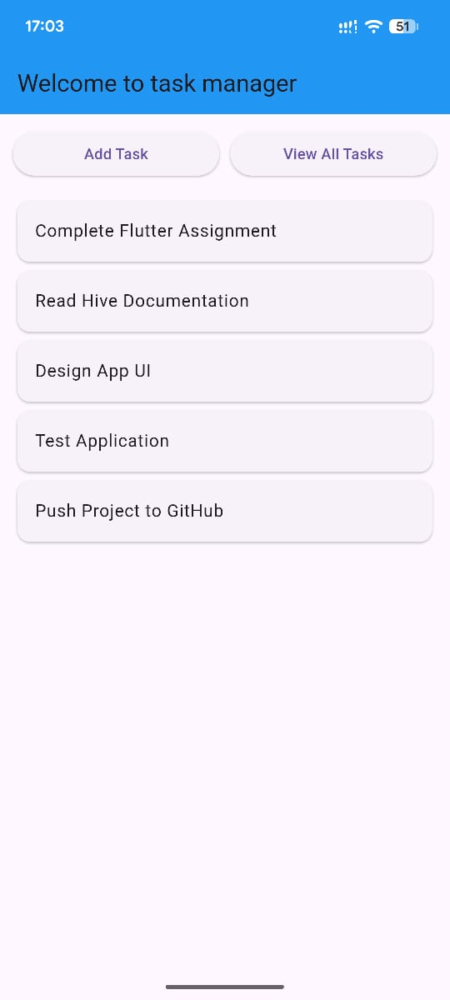
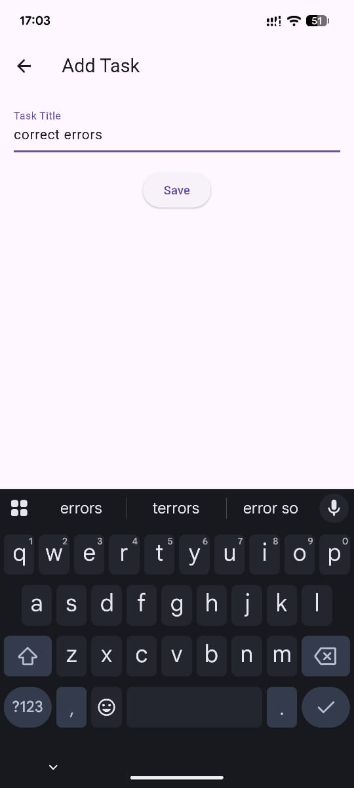
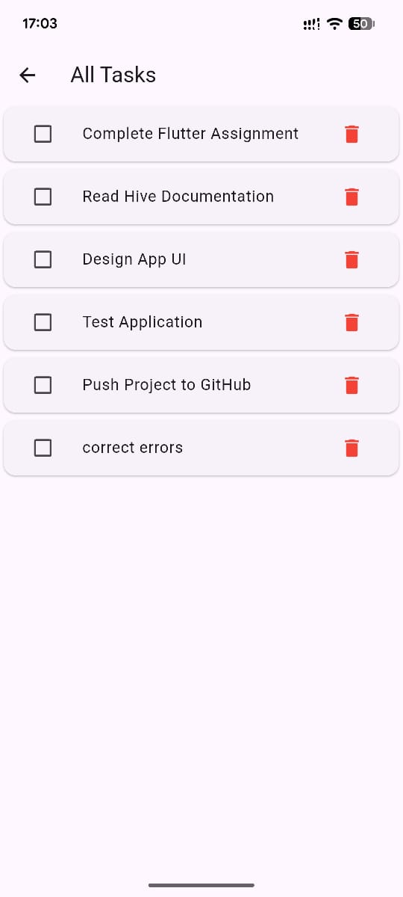
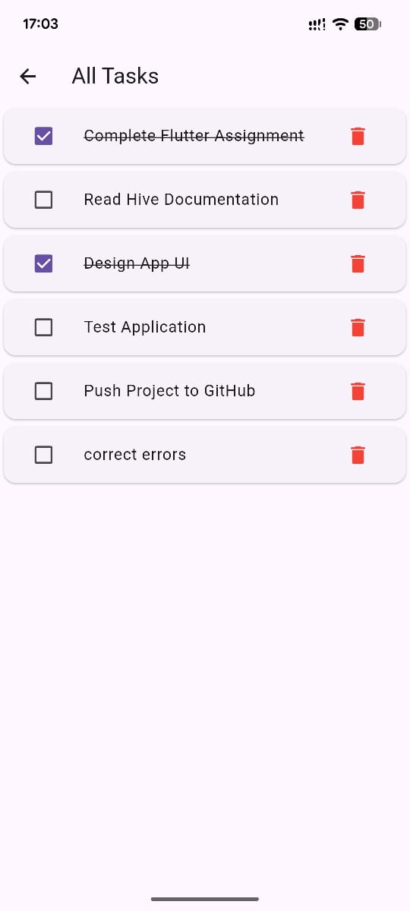

## GROUP MEMBERS

| # | NAME                         | REGISTRATION NUMBER |
|---|------------------------------|---------------------|
| 1 | IDDY SAID IDDY               | 31524/T.2023        |
| 2 | RONARD EMMANUEL NANYARO      | 32099/T.2023        |
| 3 | SHABAN HUSSEIN NDEKUPE       | 31239/T.2023        |
| 4 | KURUTHUM SAID JEREMIA        | 31334/T.2023        |
| 5 | VICTOR SOSTENES MPAMBIJE     | 32162/T.2023        |
| 6 | STEPHEN ANYIGULILE MWAITUKA  | 32143/T.2023        |


## Application description

##### application will allow user to:
1. add task
2. view added task
3. edit task
4. mark task as done
5. delete task

## How to run application

Follow these steps to run the Flutter application locally:

### 1.firstly make sure you have installed the flutter sdk and emulator in your system

### 2.Clone the Repository and open it using vscode or any code editor by running the following commands:
```bash
git clone https://github.com/mwaitukasteven/group_9_todo_list_app.git
cd group_9_todo_list_app
code .
```
### 3.then you will be required to install dependencies by running:
```bash
flutter pub get
```
### 4.then you now you are ready to run the app by running:
```bash
flutter run
```

## Screenshots of the application

### Main Screen


### Adding a Task


### List Task


### Completing a Task


### Deleting a Task
